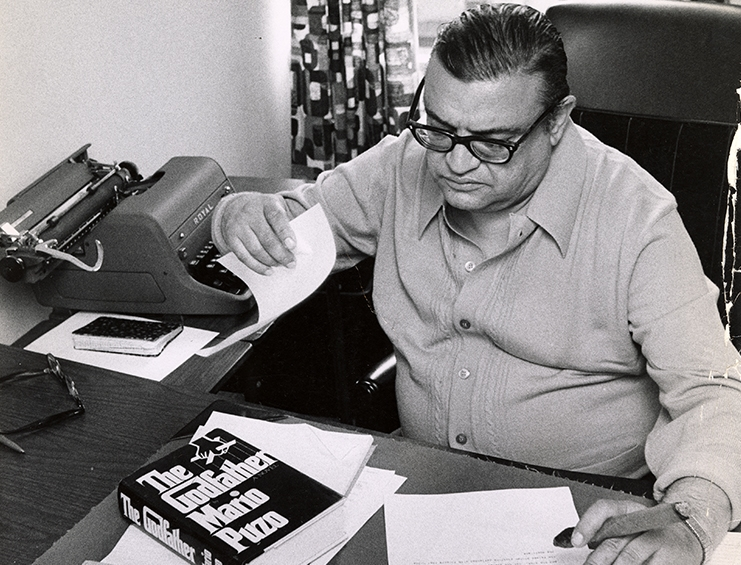

# UIkit Workshop: Tutorial

### CS 52, Spring 2018

### 04/12/2018

## Header and Navigation Bar

Let's turn to the header and the navigation bar. The [Dartmouth homepage's](https:www.dartmouth.edu) header is rather unique, but even so we can mimic it closely using the flexibility of uikit. You should begin with the HTML header structure which we have provided:

```HTML
<header class="">
  <a href="#"></a>
  <div>
    <nav class="">
      <ul class="">
        <li><a href="#">Admissions</a></li>
        ...
      </ul>
    </nav>
    <nav class="">
      <ul class="">
        <li class="" data-uk-dropdown>
          <a href="#">EDUCATION</a>
          <div class="">
            <ul class="">
              <li><a href="#">Degree Finder</a></li>
              ...
            </ul>
          </div>
        </li>
        ...
      </ul>
    </nav>
  </div>
</header>

```
The first step is formatting the layout of the header. To do so we'll use a familiar friend, `flexbox`. Uikit includes a number of flexbox-inspired classes which make the header layout easy.
* Add the `"uk-flex uk-flex-space-around uk-flex-middle"` classes to your header tag.

Now we'll turn to the navigation bar located on the right side of the header. Uikit's [Navbar classes](https://getuikit.com/v2/docs/navbar.html) provides formatting for the navigation bar and its contents.

Let's start with the first row of Dartmouth's navigation tab. This is simply a list of links. To use uikit's `navbar` formatting we:

* Add the `"uk-navbar"` class to the `<nav>` tag (the parent of the list)

This formats the `<nav>` element as a uikit navigation bar. We then have to provide formatting for the links in the list:

* Add the `"uk-navbar-nav"` class to the `<ul>` tag that opens the link list.  

The second row is a little more complicated because the *Education*, *Research* and *Life & Community* links have dropdown menus when hovered over. To first format the header links, we repeat the same process as above:
* Add the `"uk-navbar"` class to the `<nav>` tag
* Add the `"uk-navbar-nav"` class to the `<ul>` tag.

We then have to format the sub-links so that they appear as dropdown menus. To do so, we'll use uikit's [Dropdown](https://getuikit.com/v2/docs/dropdown.html) javascript feature.

We'll start with the *Education* link's dropdown. First we must specify the parent of the dropdown menu and enable the dropdown javascript:

* Add the `"uk-parent"` class and add `data-uk-dropdown` (*not as a class*) to the `<li>` tag which parents the list of sub-links.

We've included a separate container (`<div>`) for the list of sub-links. To specify this element as the container of the dropdown list:

* Add the `"uk-dropdown"` and the `"uk-dropdown-navbar"` classes to the `<div>` tag.

> The `"uk-dropdown-navbar"` class specifies that this dropdown list is part of a navigation bar, providing it with additional formatting.

Finally, we want to format the individual sub-links as elements of a navigation bar. To do so:

* Add both the `"uk-navbar" "uk-navbar-nav"` classes to the `<ul>` tag parenting the list of sub-links.

Once you have completed adding the dropdown list to the *Education* link, you should repeat the process as described above for the *Research* and *Life & Community* links.

## Grid
The Grid system is a responsive layout that allows elements to be positioned
cleanly without using flex boxes. Simply apply different classes as you did in
Bootstrap. We have copied the images from the Dartmouth homepage to redesign it
using the UIKit grid system.

Begin by taking a look at how the nested grid system works.


Similar to Bootstrap, you can apply multiple classes into an HTML element. These are
the classes that will be most commonly used:

.uk-grid: applied to grid containers
.uk-width-(fraction): specifies how the container will be divided

The grid container (parent div) can be divided into halves, thirds, fourths,
fifths, sixths, and tenths. Once sum of the fractions listed in the width classes
pass 1 (i.e. uk-grid-width-1-2 comes after two width-1-2, )


The children can then be divided again like the following:


Your turn! Divide the parent container into half and one of its children into half
again. Add the 'grid-1.jpg' to the first child, a text to the second child, and
an image of your choice to the other second child. It should look like this:


```html
<div class="uk-grid">
    <div class="uk-width-large-1-2">
        <a href="#"></a>
    </div>
    <div class="uk-width-large-1-2 uk-grid">
        <div class="uk-width-large-1-2">
            <a href="#">  </a>
        </div>
        <div class="uk-width-large-1-2 uk-align-center">
            <a href="#">  </a>
        </div>
        <div class="uk-width-small-1-2 uk-grid-match">
            <p> Roshini Pinto-Powell, a professor at the Geisel School of Medicine, discusses an ongoing pay gap between female and male doctors. The exact size of this gap varies from study to study―by which I mean it ranges from bad to worse. </p>
        </div>
        <div class="uk-width-small-1-2 uk-grid-match">
            <h3>EVENTS</h3>
            <p> APRIL 11 <br> Presidential Faculty Lecture: Sexual Violence, Social Meanings, and Narrative Selves </p>
            <p> APRIL 11 <br> Workshop: Introduction to Entrepreneurship, Daniella Reichstetter, Tuck 07, Tuck School of Business </p>
            <p> APRIL 11 <br> Artist Talk: Using Your Voice, singer Dayme Arocena talks with Dartmouths Taylor Ho Bynum </p>
        </div>
    </div>
</div>
```
(optional) Like flex boxes, we can make these divs responsive. Add the word
"medium", or "large" after "width" to have to have response from different
devices

Grid Gutters are useful for controlling

## Adding an Image Slideshow with Navigation Buttons

Let's make the webpage look better by adding a slideshow!

To start, we need to link one CSS file and two JS files. Insert the following line into your `<head>`:

```html
<link rel="stylesheet" href="uikit/css/components/slideshow.css" />
```

and the following two lines at the end of your `<body>`:

```html
<script src="uikit/js/components/slideshow.min.js"></script>
<script src="uikit/js/components/slideshow-fx.min.js"></script>
```

`slideshow-fx.min.js` isn't strictly necessary, but it enables some nice transitions which make the slideshow look classier.

Now we're ready to start! We'll begin with a basic slideshow and add functionality as we go.

With UiKit, slideshows are unordered lists with `class="uk-slideshow"`. Let's try making one by inserting the following snippet into your `<body>`:

```html
<ul class="uk-slideshow" data-uk-slideshow>
  <li>  </li>
  <li>  </li>
  <li>  </li>
</ul>
```

Note that `data-uk-slideshow` must be included in order to load the necessary JavaScript.

Take a look! You should see a single image that isn't changing. Since we have no navigation buttons, there's also no way to change that image. Annoying.


If you don't want to have any buttons, but want the slideshow to autoplay, replace `data-uk-slideshow` in the `<ul>` tag with `data-uk-slideshow="{autoplay:true}"`. Now, the slideshow should autoplay.

Navigation buttons would still be nice, though. To add navigation buttons, we'll need to create a `<div>` that holds both the slideshow `<ul>` and the buttons. We'll start by
adding previous and next image buttons. Modify your current slideshow HTML to look like the following:

```html
<div class="uk-slidenav-position" data-uk-slideshow="{autoplay:true}">
  <ul class="uk-slideshow">
    <li>  </li>
    <li>  </li>
    <li>  </li>
  </ul>
  <a href="" class="uk-slidenav uk-slidenav-contrast uk-slidenav-previous" data-uk-slideshow-item="previous"></a>
  <a href="" class="uk-slidenav uk-slidenav-contrast uk-slidenav-next" data-uk-slideshow-item="next"></a>
</div>
```

Note that the `data-uk-slideshow` must be moved to the `<div>` tag because the JavaScript needs to be loaded for the buttons as well.

With UiKit, these navigation buttons are hyperlinks with `class="uk-slidenav uk-slidenav-contrast uk-slidenav-[previous | next]"`. There's no need to put an actual link inside the `href` term.

The page should look something like this:


Now, you'll be able to navigate back and forth between images. But what if we want to skip to a particular image? We can insert a dotnav component to add this functionality. The dotnav menu is an unordered list with `class="uk-dotnav"`. We recommend using `class="uk-dotnav uk-dotnav-contrast uk-position-bottom uk-flex-center"` as well to make it look better. Each dot is a `<li>` element, where `data-uk-slideshow-item` indicates which slideshow image the dot will link to. Note that the numbers for `data-uk-slideshow-item` are zero-indexed and correspond directly to the order in which the images appear in your original slideshow `<ul>`. You could play around with these indices if you wanted (e.g. set everything to reference image 0), but that doesn't seem very productive...

```html
<div class="uk-slidenav-position" data-uk-slideshow="{autoplay:true}">
  <ul class="uk-slideshow">
    <li>  </li>
    <li>  </li>
    <li>  </li>
  </ul>
  <a href="" class="uk-slidenav uk-slidenav-contrast uk-slidenav-previous" data-uk-slideshow-item="previous"></a>
  <a href="" class="uk-slidenav uk-slidenav-contrast uk-slidenav-next" data-uk-slideshow-item="next"></a>
  <ul class="uk-dotnav uk-dotnav-contrast uk-position-bottom uk-flex-center">
    <li data-uk-slideshow-item="0"><a href=""></a></li>
    <li data-uk-slideshow-item="1"><a href=""></a></li>
    <li data-uk-slideshow-item="2"><a href=""></a></li>
  </ul>
</div>
```

You should get something that looks like this:

Hooray! You've created an image slideshow with elegant navigation buttons.
