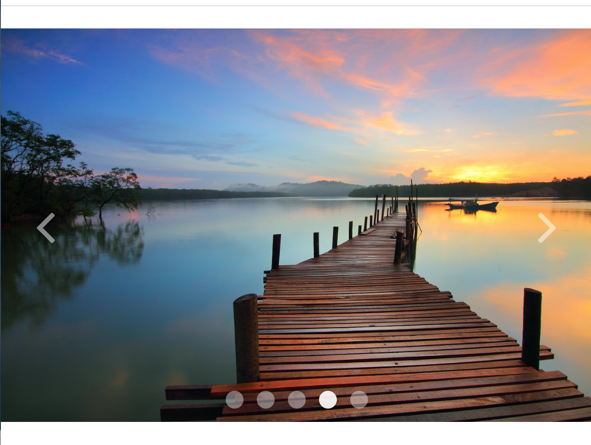

# UIkit Workshop: Tutorial

### CS 52, Spring 2018
UiKit is a lightweight open-source front-end framework for developing web interfaces. Today, we're going to explore some cool webpage features you can easily implement using UiKit.

## Overview
In this tutorial, we're going to use UiKit to easily build a classy landing page. We mimic the Dartmouth homepage - by the end of the tutorial, you'll have a landing page that looks something like the following:


We'll be implementing the following components:
- [ ] A formatted and responsive header and navbar
- [ ] An autoplaying slideshow with responsive navigation buttons
- [ ] Nicely aligned content using the UiKit grid layout
- [ ] Some images and text using smooth javascript animations with Scrollspy

## Getting Started!

To begin, start by going to this [Github repo](https://github.com/dartmouth-cs52-18S/workshop-ws-4-12-css-uikit-semanticui) and `forking` it to your account.


Now you have your own version of our workshop repo that you can change and push to.

## Header and Navigation Bar
Let's turn to the header and the navigation bar. The [Dartmouth homepage's](https://home.dartmouth.edu/) header is rather unique, but even so we can mimic it closely using the flexibility of UIkit. You should begin with the HTML header structure which we have provided:

```HTML
<header class="">
  <a href="#"></a>
  <div>
    <nav class="">
      <ul class="">
        <li><a href="#">Admissions</a></li>
        ...
      </ul>
    </nav>
    <nav class="">
      <ul class="">
        <li class="">
          <a href="#">EDUCATION</a>git
          <div class="">
            <ul class="">
              <li><a href="#">Degree Finder</a></li>
              ...
            </ul>
          </div>
        </li>
        ...
      </ul>
    </nav>
  </div>
</header>

```
The first step is formatting the layout of the header. To do so we'll use a familiar friend, `flexbox`. Uikit includes a number of flexbox-inspired classes which make the header layout easy.
* Add the `"uk-flex uk-flex-space-around uk-flex-middle"` classes to your header tag.

Now we'll turn to the navigation bar located on the right side of the header. Uikit's [Navbar classes](https://getuikit.com/v2/docs/navbar.html) provides formatting for the navigation bar and its contents.

Let's start with the first row of Dartmouth's navigation tab. This is simply a list of links. To use uikit's `navbar` formatting we:

* Add the `"uk-navbar"` class to the `<nav>` tag (the parent of the list)

This formats the `<nav>` element as a uikit navigation bar. We then have to provide formatting for the links in the list:

* Add the `"uk-navbar-nav"` class to the `<ul>` tag that opens the link list.  

The second row is a little more complicated because the *Education*, *Research* and *Life & Community* links have dropdown menus when hovered over. To first format the header links, we repeat the same process as above:
* Add the `"uk-navbar"` class to the `<nav>` tag
* Add the `"uk-navbar-nav"` class to the `<ul>` tag.

We then have to format the sub-links so that they appear as dropdown menus. To do so, we'll use uikit's [Dropdown](https://getuikit.com/v2/docs/dropdown.html) javascript feature.

We'll start with the *Education* link's dropdown. First we must specify the parent of the dropdown menu and enable the dropdown javascript:

* Add the `"uk-parent"` class and add `data-uk-dropdown` (*not as a class*) to the `<li>` tag which parents the list of sub-links.

We've included a separate container (`<div>`) for the list of sub-links. To specify this element as the container of the dropdown list:

* Add the `"uk-dropdown"` and the `"uk-dropdown-navbar"` classes to the `<div>` tag.

> The `"uk-dropdown-navbar"` class specifies that this dropdown list is part of a navigation bar, providing it with additional formatting.

Finally, we want to format the individual sub-links as elements of a navigation bar. To do so:

* Add the `"uk-nav uk-nav-navbar"` classes to the `<ul>` tag parenting the list of sub-links.

Once you have completed adding the dropdown list to the *Education* link, you should repeat the process as described above for the *Research* and *Life & Community* links.

## Adding an Image Slideshow with Navigation Buttons

Let's make the webpage look better by adding a slideshow!

To start, we need to link one CSS file and two JS files. Insert the following line into your `<head>`:

```html
<link rel="stylesheet" href="uikit/css/components/slideshow.css" />
```

and the following two lines at the end of your `<body>`:

```html
<script src="uikit/js/components/slideshow.min.js"></script>
<script src="uikit/js/components/slideshow-fx.min.js"></script>
```

`slideshow-fx.min.js` isn't strictly necessary, but it enables some nice transitions which make the slideshow look classier.

Now we're ready to start! We'll begin with a basic slideshow and add functionality as we go.

With UiKit, slideshows are unordered lists with `class="uk-slideshow"`. Let's try making one by inserting the following snippet into your `<main>` section:

```html
<ul class="uk-slideshow" data-uk-slideshow>
  <li>  </li>
  <li>  </li>
  <li>  </li>
</ul>
```

Note that `data-uk-slideshow` must be included in order to load the necessary JavaScript.

Take a look! You should see a single image that isn't changing. Since we have no navigation buttons, there's also no way to change that image. Annoying.


If you don't want to have any buttons, but want the slideshow to autoplay, replace `data-uk-slideshow` in the `<ul>` tag with `data-uk-slideshow="{autoplay:true}"`. Now, the slideshow should autoplay.

Navigation buttons would still be nice, though. To add navigation buttons, we'll need to create a `<div>` that holds both the slideshow `<ul>` and the buttons. We'll start by
adding previous and next image buttons. Modify your current slideshow HTML to look like the following:

```html
<div class="uk-slidenav-position" data-uk-slideshow="{autoplay:true}">
  <ul class="uk-slideshow">
    <li>  </li>
    <li>  </li>
    <li>  </li>
  </ul>
  <a href="" class="uk-slidenav uk-slidenav-contrast uk-slidenav-previous" data-uk-slideshow-item="previous"></a>
  <a href="" class="uk-slidenav uk-slidenav-contrast uk-slidenav-next" data-uk-slideshow-item="next"></a>
</div>
```

Note that the `data-uk-slideshow` must be moved to the `<div>` tag because the JavaScript needs to be loaded for the buttons as well.

With UiKit, these navigation buttons are hyperlinks with `class="uk-slidenav uk-slidenav-contrast uk-slidenav-[previous | next]"`. There's no need to put an actual link inside the `href` term.

The page should look something like this:


Now, you'll be able to navigate back and forth between images. But what if we want to skip to a particular image? We can insert a dotnav component to add this functionality. The dotnav menu is an unordered list with `class="uk-dotnav"`. We recommend using `class="uk-dotnav uk-dotnav-contrast uk-position-bottom uk-flex-center"` as well to make it look better. Each dot is a `<li>` element, where `data-uk-slideshow-item` indicates which slideshow image the dot will link to. Note that the numbers for `data-uk-slideshow-item` are zero-indexed and correspond directly to the order in which the images appear in your original slideshow `<ul>`. You could play around with these indices if you wanted (e.g. set everything to reference image 0), but that doesn't seem very productive...

```html
<div class="uk-slidenav-position" data-uk-slideshow="{autoplay:true}">
  <ul class="uk-slideshow uk-slideshow-fullscreen">
    <li>  </li>
    <li>  </li>
    <li>  </li>
  </ul>
  <a href="" class="uk-slidenav uk-slidenav-contrast uk-slidenav-previous" data-uk-slideshow-item="previous"></a>
  <a href="" class="uk-slidenav uk-slidenav-contrast uk-slidenav-next" data-uk-slideshow-item="next"></a>
  <ul class="uk-dotnav uk-dotnav-contrast uk-position-bottom uk-flex-center">
    <li data-uk-slideshow-item="0"><a href=""></a></li>
    <li data-uk-slideshow-item="1"><a href=""></a></li>
    <li data-uk-slideshow-item="2"><a href=""></a></li>
  </ul>
</div>
```

You should get something that looks like this:

Hooray! You've created an image slideshow with elegant navigation buttons.

## Grid
The Grid system is a responsive layout that allows elements to be positioned
cleanly without using flex boxes. Simply apply different classes as you did in
Bootstrap. We have copied the images from the Dartmouth homepage to redesign it
using the UIKit grid system.

Begin by taking a look at how the nested grid system works.


Similar to Bootstrap, you can apply multiple classes into an HTML element. These are
example classes that will be most commonly used:

`"uk-grid"`: applied to grid containers

`"uk-width-2-5"`: specifies how the container will be divided

`"uk-push-3-10"`: specifies margins between elements in the same container

`"uk-grid-medium"`: unifies the spacing between elements to medium

The grid container (parent div) can be divided into halves, thirds, fourths,
fifths, sixths, and tenths. The children can then be divided again like the following:


Each container can also be divided into multiple columns. Use the `ul` tag as the
grid container and `li` tags as the individual columns.


Grid Gutters are useful for controlling spaces between grid columns. From the
layout you just have, apply a large gutter and a small gutter. Adjust the gutter
size using `"uk-grid-large"`, `"uk-grid-medium"`, or `".uk-grid-small"`. If you want to
manually adjust spaces, use the `".uk-push/pull-*"` class. If you need spacing between
each container, apply the `"data-uk-grid-margin"` class.

Your turn! Divide the parent container into a size of your choice and then
one of its children into a size of your choice again (feel free to keep going!)
We have some sample images in our *img* folder, so feel free to use those. If you'd
like to insert a paragraph and center it, apply the `"uk-text-center class"`.

Your HTML elements should look something like this:

```html
<div class="uk-width-large-1-2">
  ...
</div>
<div class="uk-width-large-1-2 uk-grid">
  <div class="uk-width-large-1-2 uk-pull-3-5">... </div>
  <div class="uk-width-large-1-2 uk-pull-2-5"> ... </div>
  <div class="uk-width-small-1-2"> ... </div>
  <div class="uk-width-small-1-2"> ... </div>
  ...
</div>
```

(optional) Like flex boxes, we can make these divs responsive. Add the word
"medium", or "large" after "width" to have to have response from different
devices.

If you'd like to learn more about grids, please check out this [link](https://getuikit.com/v2/docs/grid.html)


## Adding in Animations using a Scrollspy
The scrollspy component uses javascript to listen to page scrolling and triggers events based on the current page position.
For example, it can be used to smoothly animate content as it scrolls into the browser window.
For reference:
[Scrollspy](https://getuikit.com/v2/docs/scrollspy.html)

Let's add another grid component with some images that we can then animate.
Add the following code to the bottom of your main tag, beneath the previous grid:
```html
<hr class="uk-grid-divider"/>
<div class="uk-grid">
  <div class="uk-width-large-1-2">
    <a href="#">
      
    </a>
  </div>
  <div class="uk-width-large-1-2 uk-vertical-align">
    <p class="uk-vertical-align-middle">
      Living and learning. At Dartmouth, you'll be part of a close-knit community anchored by campus life.
      Whether in the undergraduate residence halls or the graduate student apartments near campus, you're always near friends and faculty.
      Nearly 90 percent of undergraduates live in Dartmouth housing, including residence halls; approved co-ed, fraternity, or sorority houses; and undergraduate society and affinity houses.
    </p>
  </div>
</div>
<hr class="uk-grid-divider"/>
<div class="uk-grid">
  <div class="uk-width-large-1-2 uk-vertical-align">
    <p class="uk-vertical-align-middle">
      Philip J. Hanlon became the 18th president of Dartmouth College on June 10, 2013.
      He is the 10th Dartmouth alumnus to serve as its president and the first since the 1981 to 1987 tenure of David T. McLaughlin.
      President Hanlon, 60, formerly the Donald J. Lewis Professor of Mathematics at the University of Michigan,
      earned his Bachelor of Arts degree from Dartmouth, from which he graduated Phi Beta Kappa.
      An accomplished academic and administrative leader, Hanlon served in a succession of administrative leadership roles at Michigan for more than a decade,
      most recently as provost and executive vice president for academic affairs. He had been a member of the faculty there since 1986.
    </p>
  </div>
  <div class="uk-width-large-1-2">
    <a href="#">
      
    </a>
  </div>
</div>
<hr class="uk-grid-divider"/>
<div class="uk-grid">
  <div class="uk-width-large-1-2">
    <a href="#">
      
    </a>
  </div>
  <div class="uk-width-large-1-2">
    <a href="#">
      
    </a>
  </div>
</div>
<hr class="uk-grid-divider"/>
```
The above html added 3 grids with some associated images and text.

Animating content with a scrollspy is easy!
To animate an individual component, just add one attribute to its html:
```HTML
data-uk-scrollspy="{cls:'uk-animation-fade'}"
```
For a full list of possible animations, check out [Animations](https://getuikit.com/v2/docs/animation.html)

Let's animate the first two grids!
Try getting the content on the left side of the grids to slide in from the left, and the content on the right to slide in from the right.
It should look something like this:


This is great, but the animation only plays the first time the content is scrolled past.
To enable repeated animations, change the value of the scrollspy attribute to:
```HTML
"{cls:'uk-animation-fade', repeat: true}"
```
Animating is easy, but animating lots of different content can clutter up your html.
Fortunately, UIkit has a way to target scrollspy animations on child elements.
Let's practice this on the last grid.
Add the following attribute to the grids html:
```html
data-uk-scrollspy="{cls:'uk-animation-fade', target:'.animate-me', repeat:'true', delay:300}"
```
This code will animate any children of the grid with the class 'animate-me'.
It also delays the animations for 300ms once the components are in view.

## Customizer (Extra Steps)

One of the best features of UIkit is the `Customizer`. The Customizer is a tool on the UIkit's website that allows you to easily change the CSS attributes of any of their components. When you are done, you can just export your customized UIkit stylesheet and add it to your UIkit directory.


Let's go ahead and try it out! Go to the [UIKit Customizer](https://getuikit.com/v2/docs/customizer.html).

You'll see that the Customizer is set up so that a main page is displayed with components, and that the menu on the left allows you to change CSS properties.

Under the dropdown menu, select `Almost Flat` (it should be preselected). Then let's check the `Advanced Mode` checkbox to see all the properties we can change.

You'll see that the menu is organized alphabetically by CSS component names, which can be a little annoying to navigate since you need to scroll through to find a specific component. The Customizer also only includes the Core components, which means that customizing any extra components will require hard coding into the CSS stylesheet.

Make some changes to the color scheme and fonts in the Customizer, as well as any other changes that you want. The main page will update to reflect your custom CSS properties. Feel free to play around!

When you're done customizing, you can click on the `Get CSS` button on the bottom to download a custom `uikit.css` file. Replace the `uikit.css` in your repo (located in `repo directory > uikit > css`) with your custom file. Go into the `<head>` of your code, and change the link to your new `uitkit.css`.

```html
<link rel="stylesheet" href="uikit/css/uikit.css">
```
Open up your webpage, and the theme should have changed to your custom theme!

## Explore on your own (Extra Steps)

If you have time, take a look at the [UIkit website](https://getuikit.com/v2/index.html) and check out some of the other components under the "Core" and "Component" tabs.

Some components that we recommend for future projects...

+ Core
  + Off-Canvas
  + Smooth Scroll
  + Animation

+ Extra components
  + Dynamic Grid (super cool)
  + Search
  + Accordion
  + Slideshow

## Summary

In this tutorial, you've learned how to use UiKit to do the following:
- [x] Quickly create a nicely formatted header and navbar
- [x] Use a elegant grid layout for your webpage
- [x] Insert a autoplaying slideshow with responsive navigation buttons
- [x] Make smooth javascript animations with Scrollspy
- [ ] Use Customizer to tailor UiKit's CSS components (Optional)

## Resources

   * [Our Slide Deck](https://docs.google.com/presentation/d/1lbW8hplNwptF1FJcyNFEIEKIbn2PuMa5igbNJpVxqpY/edit?usp=sharing)
   * [Comparison Bootstrap vs UIkit](https://www.slant.co/versus/504/10831/~bootstrap_vs_uikit)
   * [UIkit v2 Tutorials](https://getuikit.com/v2/docs/tutorials.html)
   * [UIkit Core](https://getuikit.com/v2/docs/core.html)
   * [UIkit Additional Components](https://getuikit.com/v2/docs/components.html)
